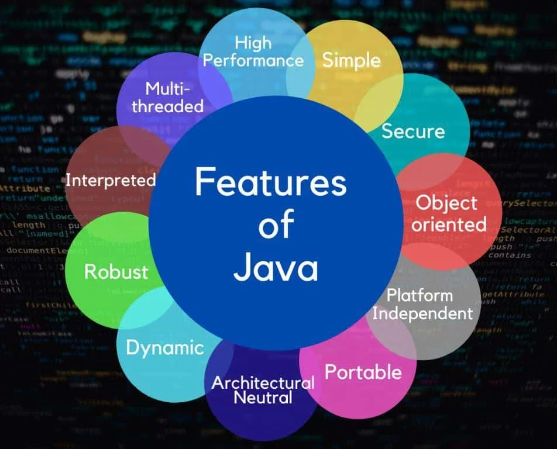

Let's begun a cute JAVA journey!!

Why to Learn?

Have a look at a small but very useful project!

# investment-tracker-application-journey-1
Small Investment Tracker Application using the basics of Java

1. The very first step will be to accept the buying prices per share that the user has purchased.
2. Need to accept the closing price of that share for each day of the week (also helps us to find the profit, loss or nothing made by user/buyer).
3. Finally, once we have done the calculations, we will list the earnings earned by the users in the whole week.

Simple yet amazing command-line program as a small inverstment tracker application (Best for you 1'st year if u're a Java geek!).
